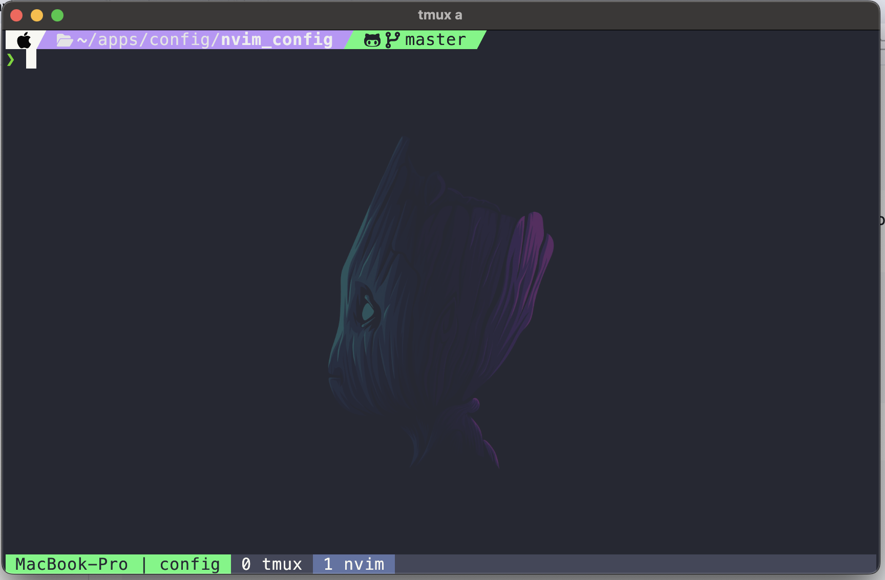
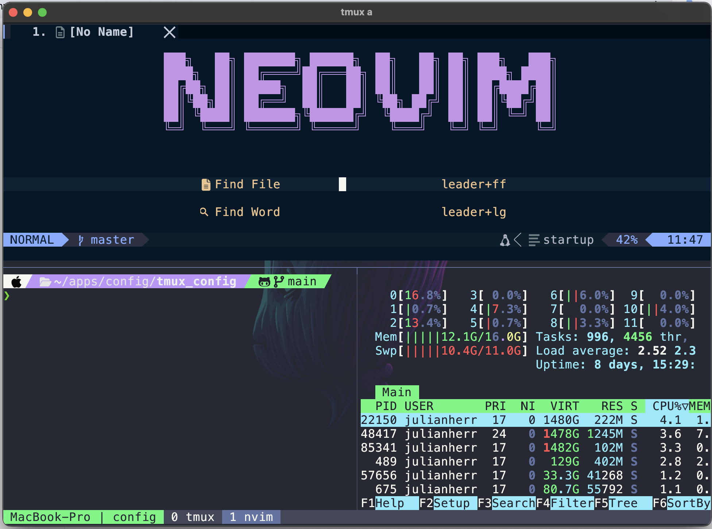

# environment_configuration_terminal

This repository contains the terminal configuration used on the computer. It
keeps each tool's configuration under version control so the same terminal
environment can be restored or updated from one location.

## Preview

The configuration combines Kitty, Zsh, Tmux, and Neovim into a single terminal
workflow:





## Usage

Clone this repository into the fixed project directory
`~/environment_configuration_terminal`. Configure each tool to reference the
files inside that clone instead of copying them elsewhere:

```bash
git clone https://github.com/jueshebe/environment_configuration_terminal.git \
  ~/environment_configuration_terminal
cd ~/environment_configuration_terminal
```

The clone location is part of the configuration because the background image
paths rely on it. Symbolic links are optional: create them only when you want
the active tool configuration to synchronize automatically with repository
updates. Without a symbolic link, copy the repository configuration file to
the tool's configuration path instead. Each tool's README gives the exact
source and destination paths. After the initial setup, update the repository
configuration by pulling the latest changes:

```bash
git pull
```

## Configurations

- [Kitty](kitty/README.md): the terminal emulator. Its configuration sets the
  Dracula colors, MesloLGS Nerd Font, window behavior, wallpaper, and desktop
  application icon.
- [Zsh](zsh/README.md): the interactive shell. Its setup installs Oh My Zsh,
  the Powerlevel10k prompt, and plugins for suggestions, syntax highlighting,
  environment loading, and clipboard commands.
- [Tmux](tmux/README.md): the terminal multiplexer. Its configuration provides
  persistent terminal sessions, custom key bindings, mouse support, pane
  management, and plugins managed by TPM.
- [Neovim](nvim/README.md): the extensible text editor. Its Lua configuration
  and plugins are managed with vim-plug.
